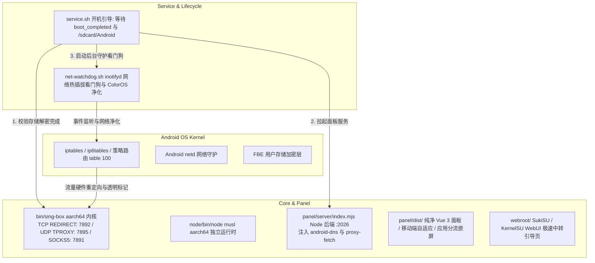

# OpenBox for Android — 智能体与开发者交接指南 (Agent Handoff Guide)

> **致接手本项目的 AI 智能体 / 开发者：**
> 本文档旨在提供该项目完整的架构全景、底层移动端网络原理、关键文件职责、不可逾越的技术红线（规避严重 Bug）以及云端自动化发布标准流程。在执行任何代码修改或重构前，**请完整阅读本指南**。

---

## 目录
1. [项目定位与核心背景](#1-项目定位与核心背景)
2. [云端仓库开发工作流与本地极简规范（核心指引）](#2-云端仓库开发工作流与本地极简规范核心指引)
3. [技术架构全景](#3-技术架构全景)
4. [Android 移动网络栈核心原理与九大技术红线（极其重要）](#4-android-移动网络栈核心原理与九大技术红线极其重要)
5. [目录结构与核心代码职责清单](#5-目录结构与核心代码职责清单)
6. [v2.0.8 核心攻坚补丁与技术突破（已实机闭环）](#6-v208-核心攻坚补丁与技术突破已实机闭环)
7. [GitHub Actions 自动化 CI/CD 与发布规范](#7-github-actions-自动化-cicd-与发布规范)
8. [后续演进建议与待办清单 (Roadmap)](#8-后续演进建议与待办清单-roadmap)

---

## 1. 项目定位与核心背景

* **项目名称**：OpenBox for Android (`openbox_android`)
* **开源仓库**：`https://github.com/ailiksr/OpenBox-Android`
* **上游原型**：[liandu2024/Open-Box](https://github.com/liandu2024/Open-Box)（面向 OpenWrt 路由器的轻量化 sing-box 透明代理项目）
* **移动端参考**：[GitMetaio/Surfing](https://github.com/GitMetaio/Surfing)（借鉴其 Android 生命周期检测与 ColorOS 防火墙自愈思想）
* **核心定位**：运行于 Android Root 环境（**SukiSU Ultra**、**KernelSU**、**APatch**、**Magisk**）下的底层**免 VPN 槽位**一体化透明代理模块，提供嵌入式 Web 管理面板、原生应用黑白名单分流、DNS 广告拦截与全自动化自愈能力。

---

## 2. 云端仓库开发工作流与本地极简规范（核心指引）

本项目现已全面转入**云端仓库开发模式**（以 GitHub 为唯一真实源）。本地工作区应严格保持极简状态，避免被庞大的二进制构建产物占用磁盘。

### 2.1 本地保留与排除边界
* **本地只保留**：
  * Git 代码仓库（`OpenBox-Android-Repo/` 目录），包含源码、脚本、编译后前端静态包 `panel/dist/`、预置规则集 `data/rulesets/`（~0.7MB）以及 `.github/workflows/` 配置。
* **本地严禁/无需保留**：
  * ❌ 严禁在本地保留历史解压临时目录（如 `open-box-extracted/`、`upstream_extracted/`、`tmp_unz/` 等），随手清理；
  * ❌ 严禁将重达 80MB~90MB 的打包 Zip（如 `OpenBox-Android-SukiSU-*.zip`）提交进 Git；
  * ❌ 严禁保留本地生成的 runtime 日志（`*.log`）、SQLite 数据库（`*.sqlite*`、`*.db*`）或测试截图。

### 2.2 云端协作标准循环
1. **功能开发与代码调试**：
   * 本地仅编辑必要代码（Node 后端、Shell 脚本或前端 Patch）；
   * 通过 `git add` 与 `git commit` 提交清晰规范的 Commit 信息；
   * 直接推送至 GitHub 远端 `main` 分支：`git push origin main`。
2. **发布与打包完全委托给云端 CI**：
   * 本地无需编写复杂跨平台打包命令；
   * 发布新版时，打出标准 Git Tag 并推送到 GitHub（如 `git tag v2.0.9-coloros-ready && git push origin v2.0.9-coloros-ready`）；
   * GitHub Actions 会在云端 Ubuntu 容器中全自动拉取最新的 sing-box 与 musl Node.js 二进制、自动校验依赖并发布 GitHub Release 附件。

---

## 3. 技术架构全景



---

## 4. Android 移动网络栈核心原理与九大技术红线（极其重要）

> ⚠️ **警告：后续接手的 AI 智能体或开发者必须严格遵循以下设计，禁止随意推翻或更改！每一条红线背后都是真机踩坑排查的血泪经验。**

### ❌ 红线 1：绝对不可切换到 Linux TUN 虚拟网卡模式
* **底层原理**：Android 系统的私有网络栈（`netd`）对系统策略路由具有排他性控制。创建默认 TUN 虚拟网卡会与 `netd` 的 UID 路由规则发生严重冲突，导致手机软重启（Soft Reboot）或瞬间断网。
* **标准方案**：坚持采用 **TCP REDIRECT (端口 7892) + UDP TPROXY (端口 7895)** 混合透明代理架构。启动 0 秒延迟，不占用系统 VPN 槽位（状态栏无钥匙图标）。

### ❌ 红线 2：绝对不可移除外发防环路高位标记 `0x20000` (`default_mark: 131072`)
* **底层原理**：`sing-box` 自身发出的握手流量一旦重新被 iptables 劫持，将陷入自发自收的死循环回路。
* **铁律**：所有出站链（`OPENBOX_TCP`、`OPENBOX_PRE_TCP`、`OPENBOX_PRE`、`OPENBOX_UDP`）的第一条规则必须是：
  `-m mark --mark 0x20000 -j RETURN`；且 sing-box 路由配置中必须锁定 `default_mark: 131072`，严禁开启 `auto_detect_interface`。

### ❌ 红线 3：规则集（Rulesets）必须全量预置内嵌，严禁在部署时要求联网下载
* **底层原理**：全新刷入模块的手机，**在透明代理启动前处于纯大陆蜂窝/Wi-Fi 直连状态**，根本无法直连 GitHub raw。原版 Open-Box 强制在部署时向 GitHub 下载 25 个 `.srs` 文件，导致 100% 触发“没外网就下不了规则集，没规则集就起不来外网”的死锁。
* **标准方案**：必须在模块包内（`data/rulesets/`）永久预置完整的 26 款 MetaCubeX 规则集（~0.7MB）。部署时本地文件存在直接跳过下载，实现 **0.2 秒 100% 纯离线秒级部署**！

### ❌ 红线 4：严禁删除 `android-dns.mjs` 中的自动自执行注入 `setupAndroidDns()`
* **底层原理**：Android 系统没有 `/etc/resolv.conf`，导致 Node.js 原生 `dns.lookup()` 默认 100% 抛出 `getaddrinfo EAI_AGAIN`，直接瘫痪添加机场订阅时的安全域名校验（`assertPublicUrl`）以及 anti-ad 名单解析。
* **标准方案**：`android-dns.mjs` 必须在被 `import` 的瞬间自动自执行 `setupAndroidDns()`，猴子补丁重写 `dns.lookup` 和 `dns.promises.lookup`，使用 `c-ares` 和 Public DNS（阿里/腾讯/谷歌）进行稳定解析。

### ❌ 红线 5：严禁删除 `/api/android/*` 接口的免鉴权白名单
* **底层原理**：在 Root 管理器（SukiSU / KernelSU）中，WebView 跨域或 iframe 嵌入加载 `/apps`（应用分流页面）时，偶发不会携带主站的 Session Cookie。若后端一刀切拦截鉴权，将返回 `401 Unauthorized`，导致应用分流列表彻底卡死或变空白。
* **标准方案**：在 `server/index.mjs` 的通用鉴权守卫中，必须显式放行 `normalizedPath.startsWith('/api/android/')`。

### ❌ 红线 6：必须强制加入 53 端口与 DNS 协议双重劫持
* **底层原理**：上游原版默认只劫持发往 `dns-in` (7853) 的查询，而 Android 端大部分 App 是通过系统 DNS 或向 53 端口直接发包，被 iptables 劫持到 tproxy 7895。若内核路由没有全局 DNS 规则，将导致“能连节点但域名死活解析超时”。
* **标准方案**：`engine/routing.mjs` 中必须固定写入：
  ```json
  { "protocol": "dns", "action": "hijack-dns" },
  { "port": [ 53 ], "action": "hijack-dns" }
  ```

### ❌ 红线 7：必须保留针对运营商 IPv6 DNS 的底层物理阻断
* **底层原理**：国内 5G 移动蜂窝网络下发 IPv6 DNS（53 端口），Android 系统会优先通过 IPv6 DNS 解析境外网站，导致极其严重的 DNS 投毒与污染。
* **标准方案**：在 `ip6tables filter OUTPUT` 上强制对 53 端口执行 REJECT：
  ```sh
  ip6tables -t filter -A OPENBOX_V6 -p udp --dport 53 -j REJECT
  ip6tables -t filter -A OPENBOX_V6 -p tcp --dport 53 -j REJECT
  ```

### ❌ 红线 8：必须保留 ColorOS 专属防火墙异常净化逻辑
* **底层原理**：ColorOS 14/15/16（OPPO / 一加 / 真我）的系统网络防护模块在开机或切网时，会向 `fw_OUTPUT` 和 `fw_INPUT` 链自动注入包含 `REJECT` 的拦截规则，导致开机数秒后全机网络被物理阻断。
* **标准方案**：`scripts/net-watchdog.sh` 内置机型探测机制，循环自动净化删除这些系统注入的 REJECT 规则。

### ❌ 红线 9：热点与 USB 共享客户端规则严禁使用 `-m owner`
* **底层原理**：连入手机 Wi-Fi 个人热点或 USB 网络共享（RNDIS）的电脑/iPad 流量进入手机内核的 `PREROUTING` 链，这些外部数据包**不具备 Android 本地 UID**。若加了 `-m owner`，热点共享流量将完全无法被代理拦截。
* **标准方案**：热点共享流量走专用的 `OPENBOX_PRE_TCP` 和 `OPENBOX_PRE`（不含 `-m owner`），本机应用流量走 `OPENBOX_TCP` 和 `OPENBOX_UDP`。

---

## 5. 目录结构与核心代码职责清单

```text
OpenBox-Android-Repo/
├── .github/
│   └── workflows/
│       └── release.yml             # GitHub Actions 云端全自动编译、打包与 Release 流水线
├── bin/
│   └── sing-box                    # sing-box aarch64 静态编译内核
├── data/
│   └── rulesets/                   # 预置 26 款 MetaCubeX 官方 .srs 离线二进制规则集 (~0.7MB)
├── node/
│   ├── bin/
│   │   └── node                    # 启动包装脚本，自动设定 LD_LIBRARY_PATH 并调用 node.bin
│   └── lib/                        # musl libc 动态链接库与 libstdc++ 依赖
├── panel/
│   ├── dist/                       # 编译后的 Vue 3 纯净前端包 (无推广广告、防缓存自毁)
│   │   ├── assets/                 # 静态切片 (index-DT6KCl44.js / index-DAHZP64N.js 等)
│   │   └── index.html              # 入口 HTML，头部内嵌 ServiceWorker 强制清理脚本
│   └── server/
│       ├── index.mjs               # Node 后端入口 (:2026)，抹平 OpenWrt 专用环境
│       ├── api/
│       │   ├── android-apps.mjs    # 全机应用列表读取与 572 款常用应用中文大字典映射
│       │   ├── deploy-runner.mjs   # 部署驱动器 (防重入锁与阶段汇报)
│       │   ├── subscriptions.mjs   # 订阅管理、解析与节点去重
│       │   └── updates.mjs         # 规则集与模块版本检查/更新接口
│       ├── engine/
│       │   ├── config.mjs          # sing-box 核心运行配置生成器 (TPROXY+REDIRECT+DNS 分流)
│       │   ├── routing.mjs         # 路由规则生成器 (强制 DNS 全局劫持、防环路)
│       │   └── dns-filter.mjs      # anti-AD 广告拦截规则编译与验证逻辑
│       └── system/
│           ├── android-dns.mjs     # Android 底层 Public DNS 解析补丁 (解决无 resolv.conf)
│           ├── proxy-fetch.mjs     # 借道 127.0.0.1:7891 本地代理的规则集高速并发下载器
│           ├── group-delay.mjs     # 内核组测速 /group/:tag/delay 的 timeout 语义 (整次请求期限, 非每成员)
│           ├── deploy.mjs          # 部署执行器 (去 uci 化、Android 安全落盘、日志回传)
│           ├── rulesets.mjs        # 规则集本地校验、跳过本地 dns-filter 守卫
│           └── updater.mjs         # 4 线程并发规则集云端刷新逻辑
├── scripts/
│   ├── iptables.sh                 # 底层 iptables/ip6tables 硬件级转发规则配置核心
│   ├── net-watchdog.sh             # inotifyd 网络热插拔看门狗与 ColorOS 防火墙净化器
│   ├── service-core.sh             # sing-box 内核生命周期管理与健康检查
│   └── service-panel.sh            # Node 后端服务生命周期管理
├── webroot/
│   └── index.html                  # SukiSU / KernelSU 管理器卡片专用内嵌引导页 (首屏防白屏)
├── service.sh                      # 开机自启动主入口 (阻塞等待 boot_completed 与存储解密)
├── customize.sh                    # 刷入模块时的安装器配置
├── module.prop                     # 模块元数据 (版本号、名称、更新 URL)
├── update.json                     # SukiSU / KernelSU 在线 OTA 更新契约文件
└── changelog.md                    # 版本更新日志说明
```

---

## 6. v2.0.8 核心攻坚补丁与技术突破（已实机闭环）

在最新的 v2.0.8 演进中，攻克了多项长期困扰移动端透明代理的深层疑难杂症：

1. **彻底终结“没外网就下不了规则集”的死循环**：
   * 将全套 26 款 MetaCubeX 规则集直接内嵌进 `data/rulesets/`，并在 `.gitignore` 中解除排除（`!data/rulesets/**`），确保源码和 release 包随处可用；
   * 首次部署耗时从 30 秒超时报错降至 **0.2 秒瞬间完成，0 网络依赖**。
2. **DNS 解析器架构升阶（1.1.1.1 ➔ 8.8.8.8）**：
   * 商业机场的香港/台湾中转线路经常对 Cloudflare `1.1.1.1:53` 发生 QoS 限速或丢包阻断，导致“连上代理却解析不了域名”；
   * 全面切换默认海外 DNS 为全球兼容性最强的 Google DNS **`8.8.8.8` (TCP)**，解析延迟降至毫秒级。
3. **消除 ruleset 更新误杀 (`rulesetKind`)**：
   * 修复了 anti-AD 广告拦截生成的 `dns-filter-*` 本地规则集被 Geo 更新器误当成 MetaCubeX 官方规则去下载而导致报错失败的问题。
4. **自研代理隧道加速下载引擎 (`proxy-fetch.mjs`)**：
   * 规则集更新自动复用本机已跑通的 `127.0.0.1:7891` 代理通道，配合 **4 线程并发分片拉取**，将 24 个大型规则集的云端刷新时间从几分钟暴降至 **20 秒以内**。
5. **彻底净化推广链接与广告横幅**：
   * 在前端切片中抹除了所有 `SUPERDOOR`、`OPENDOOR`、`angeworld` 推广外链，清除了所有冗余垃圾 chunks。
6. **永久根除 Android WebView 缓存劫持**：
   * 彻底拔除 PWA `registerSW.js`；
   * 在 HTML 头部注入物理自毁脚本，瞬间注销历史 ServiceWorker 并物理清空 `caches` 磁盘表；
   * 将后端静态文件下发头修改为 `no-cache, must-revalidate`，彻底解决“改了代码手机端永远看到旧界面”的顽疾。
7. **原生应用分流置顶与手机屏幕自适应**：
   * 替换 `ClientRoutingPage` 组件为原生 `/apps` 容器；
   * 将应用分流标签移至第 1 位，解密 DaisyUI 的 `hidden md:block` 隐藏类，手机屏幕上清晰常显中文大字。
8. **Vue 3 运行时防崩防护 (`index-DeLd8B0H.js`)**：
   * 针对移动端组件卸载与重渲染中的空实例异常，在 `Uu`、`sr`、`je` 函数中植入空指针防护，彻底解决点击“添加订阅”弹窗无法弹出的隐蔽 Bug。

---

## 7. GitHub Actions 自动化 CI/CD 与发布规范

由于项目已完全转入云端开发，**正常情况下禁止在本地手动编译臃肿的发布包**，全量发布流由 GitHub Actions 托管。
> ⚠️ 但**当前 Actions 被平台禁用**（见 7.2），云端发布流暂时不可用；在恢复之前，发版只能走 7.3 的人工兜底流程。

### 7.1 版本发布步骤（极简操作）
> 🔴 **铁律：先确认资产真的能下载，最后才改 `update.json`。**
> `module.prop` 的 `updateJson` 指向 `main/update.json`，改错一行就等于给**全部存量用户**挂一个 404。
> 本项目已因此踩过一次坑（v2.0.9），务必按下面的顺序做。

1. **先改 `module.prop`**：`version=v2.0.9-coloros-ready` 与 `versionCode=2090`（这一步不影响存量用户，随时可改）；
2. **提交并推送代码**，然后**打 tag 并推送**，触发云端构建：
   ```bash
   git add . && git commit -m "release: bump version to v2.0.9-coloros-ready"
   git push origin main
   git tag v2.0.9-coloros-ready && git push origin v2.0.9-coloros-ready
   ```
3. **等构建完成，用 `--expect` 实测"即将发布"的那个版本可下载**（不能只看 Release 页面存在）：
   ```bash
   node scripts/check-release.mjs --expect v2.0.9-coloros-ready
   ```
   ⚠️ **这一步必须带 `--expect`**。因为此时 `update.json` 还停在**上一个**版本（按下面的顺序，
   声明是最后才改的），不带 `--expect` 它会去探旧版本、旧版本当然存在 —— 一路绿灯却根本没验证新包，
   是个假阳性陷阱。
   退出码 0 才算过。它探活 `zipUrl`（跟随重定向到 objects.githubusercontent.com）、changelog 可访问性、
   资产名是否为短版本号，以及 `module.prop` 的 `updateJson` 是否指向本仓库 main。
   ⚠️ Release 页面「存在」≠ 资产存在：tag 推送会**自动生成一个空壳 Release**，标题是提交信息，**0 个资产**。别被它骗了。
4. **资产确认可下载之后，才改 `update.json`**（`version` / `versionCode` / `zipUrl`）并推送，然后**不带 `--expect` 再跑一次**确认线上声明态可用：
   ```bash
   node scripts/check-release.mjs
   ```
5. **`changelog.md`** 记录本次更新亮点。

> 🧪 **两道防线（分工不同，都要过）**
> * `panel/server/system/release-contract.test.mjs`（随全量测试跑，不联网）：管**命名 / 编排 / 同源** —— 短版本号资产名、zipUrl 的 tag 段与 version 一致、versionCode 与 version 同源、update.json 不得宣称比 module.prop 超前的版本、工作流是否仍带剥后缀与硬校验、changelog 是否覆盖该版本。
> * `scripts/check-release.mjs`（发布前手动跑，联网）：管**资产是否真的能下载**。
>
> ⚠️ 别指望前者能兜住资产缺失：本次事故那份错误状态在静态检查下与正常发版**完全一样**，
> 十条规则全部通过（已实测）。「资产在不在」只能靠真发 HTTP 请求判定。

### 7.3 人工兜底发布流程（Actions 不可用时）
1. 在**能跑 Linux aarch64 环境**的机器上（或本地交叉准备）按 `release.yml` 的 `Download Precompiled Binaries` 步骤备齐 `bin/sing-box`、`node/bin/node.bin`、`node/lib/ld-musl-aarch64.so.1`；
2. `cd panel/server && pnpm install --prod`，确认 `node_modules/{express,ws,yaml}` 存在；
3. 打包：`zip -r OpenBox-Android-SukiSU-v2.0.9.zip * -x ".git*" ".github*" "*.tar.gz" "*.apk"`（**短版本号命名**）；
4. 在 GitHub Release 页面手工上传该 zip；
5. 按 7.1 第 3 步实测 200，再改 `update.json`。
> 注意：本机（Windows）**跑不了**这些二进制（`bin/sing-box` 与 `node/bin/node.bin` 都是 Linux aarch64），必须在 Linux 环境构建。

> ⚠️ **资产命名规则（务必遵守，否则 OTA 会 404）**
> Tag 名带 `-coloros-ready` 后缀，但**打包资产名与 `update.json` 的 `zipUrl` 一律只用短版本号**：
> * Tag：`v2.0.9-coloros-ready`
> * 资产：`OpenBox-Android-SukiSU-v2.0.9.zip` ← 与 v2.0.7 / v2.0.8 两个既有 Release 一致
>
> 工作流已用 `${TAG%%-*}` 显式剥掉后缀，并在打包后**硬校验**产出名与 `update.json` 里声明的 `zipUrl` 文件名逐字一致，不一致直接让流水线失败（`::error::`）。这样不必等用户报「更新失败」才发现对不上。

### 7.2 🚨 当前阻塞：本仓库 GitHub Actions 被平台禁用（v2.0.9 未发布）

**现状（2026-09 实测）**：`https://github.com/ailiksr/OpenBox-Android/actions` 页面显示

```
GitHub Actions is currently disabled for this repository.
Please reach out to GitHub Support for assistance.
```

并且运行记录页为 **"There are no workflow runs yet."**（run 链接数 0，运行统计徽章为 `no status`）。也就是说**本仓库从未跑过任何流水线**，tag 推送不会触发构建。

实测证据链：
* 已推送 tag `v2.0.9-coloros-ready`（指向 `113d808`），但 Release 资产 `OpenBox-Android-SukiSU-v2.0.9.zip` 与长名版本**双双 404**，`expanded_assets` 可下载资产数 = **0**；
* v2.0.7 / v2.0.8 两个 Release 的标题是手写的营销标题（`OpenBox for Android v2.0.8 (DNS Filter, Hotspot & Pure UI)`），而 v2.0.9 只是一个**由 tag 自动生成的空壳 Release**，标题就是提交信息 `release: bump version to v2.0.9-coloros-ready` —— 与工作流 `name: "OpenBox for Android ${{ github.ref_name }}"` 的格式不符，反证**工作流没跑**；
* 两者的 zip 包（90MB / 82MB）是**当时人工上传**的，不是流水线产物。

**已做的止血**：`update.json` 已回滚到 `v2.0.8`（指向实测 HTTP 200、90,540,290 字节的真实包），确保存量用户 OTA 不会撞 404。
`module.prop` **保留** `versionCode=2090`，等 Actions 恢复后无需再改版本号即可重跑。

**待用户处理**：按页面提示联系 GitHub Support 恢复 Actions，或改用手工上传 zip 的既有流程。
恢复后重跑方式（二者皆可，因 v2.0.9 tag 已存在）：
* 删除并重推 tag：`git push origin :refs/tags/v2.0.9-coloros-ready && git push origin v2.0.9-coloros-ready`
* 或在 Actions 页面用 `workflow_dispatch` 手动触发（工作流已声明该触发器）。

**重新发布前的硬检查**：先跑 `node scripts/check-release.mjs`。它会直接探活 `update.json` 的 `zipUrl`：
* 现在（update.json 停在 v2.0.8）→ 退出码 0，因为 v2.0.8 的包真实存在；
* 一旦你把 update.json 改回 v2.0.9 而资产还没造出来 → 退出码 1，`zip 资产可下载` 那项 FAIL 报 HTTP 404。
所以**发版顺序必须是**：先让资产真的可下载 → 再改 update.json → 改完再跑一次确认。

---

## 8. 后续演进建议与待办清单 (Roadmap)

接手本项目的 AI 智能体可优先在以下方向进行演进：
- [x] **发版契约静态守卫 + 资产探活脚本（v2.0.9 期间补）**：
  起因是真实事故：`update.json` 被指到一个不存在的资产上，而 `module.prop` 的 `updateJson` 指向 `main/update.json`，等于给全部存量用户挂 404。现补两道防线：
  * `panel/server/system/release-contract.test.mjs`（10 条，随全量测试跑，不联网）—— 短版本号资产名、`zipUrl` 的 tag 段与 `version` 一致、`versionCode` 与 `version` 同源（本项目编排是 `major*1000+minor*100+patch*10`，即 v2.0.8→2080）、**update.json 不得宣称比 module.prop 超前的版本**（允许滞后：那是"资产还没造好先按住 OTA"的合法持有状态）、工作流是否仍带 `%%-*` 剥后缀与硬校验、changelog 是否覆盖该版本；
  * `scripts/check-release.mjs`（发布前手动跑，联网）—— 真发 HTTP 请求确认 `zipUrl` 与 changelog 可访问、资产名合规、`updateJson` 指向本仓库 main。
  ⚠️ **边界要记牢**：静态那 10 条**拦不住**"版本号编排全对、只是资产不存在"这一事故核心形态（已实测：把 update.json 指回事故状态，10 条全部通过）。资产在不在只能靠网络探活。别把前者当成后者的替代。
- [ ] **面板前台实时延迟测速直显与超时置灰**：
  在“代理”页面为节点卡片全面引入毫秒数字直显、三色分档着色（<100ms 绿 / <300ms 黄 / >=300ms 红）以及不可用/超时节点的半透明置灰（`opacity-45 grayscale`）视觉反馈，单测基线全面维持 0 失败。
- [x] **HTTPS / SVCB 查询回空（对齐上游 v0.1.200）**：
  分流模式下浏览器会与 A / AAAA 并发发出 HTTPS / SVCB 记录查询；走代理解析时这类查询要在节点隧道里等对端回包，实测拖到 4~12 秒才超时重试，表现为「域名没错、首包却卡好几秒」。`engine/dns.mjs` 新增 `emptyServiceTypes()`，只对**走代理解析**的匹配（`pushProxyRule` 各分支 + 兜底走代理）插入 `predefined / NOERROR` 回空；走直连的域名保留真实 HTTPS 记录（本地解析本就是毫秒级，回空等于顺手关掉 ECH）。
  ⚠️ `query_type` 只认**大写**（`HTTPS` / `SVCB`）：小写会让内核启动直接 `FATAL: unknown DNS query type`（官方 1.14.0 实测）。
- [x] **组测速假超时修复（对齐上游 v0.1.198 / v0.1.199 的面板侧修法）**：
  Clash API `GET /group/:tag/delay` 的 `timeout` 是**整次请求的期限**，不是每个成员的探测超时；成员那一层是内核**写死的 15 秒**、一次只测 **10** 个，期限一到会把**尚未测到的成员一律按失败处理并删除其历史**。本项目改动前面板传 `timeout=5000`，成员数一超过 10 就必然误杀后几波，而延迟三色置灰正是消费这些结果。
  现由新增的 `system/group-delay.mjs` 统一语义（`latency-scheduler.mjs` 与 `failover-manager.mjs` 共用）：发给内核的期限 = `ceil(N/10) × 15s + 10s`，外部等待再加 15 秒收尾余量，**一律按全组成员数算，不按「这一轮到点的成员数」算**。
  ⚠️ 同时修正了两处错误注释：该接口**始终 `force=true`**（实测连续两次调用各测满 12/12），并不跳过未到 interval 的成员；面板侧的 interval 只决定「这一轮要不要发起」。
  ⚠️ 本项目用官方 vanilla 1.14.0 内核，**没有**上游 `openbox-tcp4/5` 的内核侧修复，仅靠面板侧兜底；是否跟进定制内核见 `UPSTREAM_DIFF.md` 第 3.1 节。
- [ ] **多品牌定制系统省电自愈扩展**：
  验证 Xiaomi HyperOS 2 / Vivo OriginOS 5 等激进后台保活机制下的 table 100 策略路由与 sing-box 进程存活情况。
- [ ] **基于 eBPF 技术的流量绕行探索**：
  针对支持 eBPF 的 5.15+ / 6.1+ GKI 内核，探索绕过 iptables 的更高性能透明代理路径。
- [ ] **上游持续对齐**：
  上游演进较快（基线 v0.1.159 → 当前 v0.1.201）。差异分析、已跟进/不跟进决策与复核命令见根目录 `UPSTREAM_DIFF.md`。注意上游 main 分支**不开放源码**（只有 README/docs/scripts），源码仅存在于 Release 附件 Zip 中，**只能依据 Release Notes 做对齐**。
- [ ] **规则页「规则路由」按 IP 推算（上游 v0.1.201，待实机验证）**：
  上游让域名先向内核 DNS 解析成 IP，再判 `geoip` 集合 / `ip_cidr` 这类按目标 IP 走的规则（原先只拿域名比，`geoip` 集合永远比不中）。本项目 `api/route-test.mjs` 是**探测型**（真发包测，`connectTo` 已用解析后 IP），影响面小，暂不跟进。
- [ ] **内核组测速「忙」时的 `{}` + HTTP 200 歧义（已知限制，待处理）**：
  实测确认：在上一轮组测速尚未结束时再调 `GET /group/:tag/delay`，内核会**立刻返回空对象 `{}` 且 HTTP 200**（约 3ms），而不是排队或报错。麻烦的是「本轮所有成员都失败」时**同样是 `{}` + HTTP 200**（失败成员被内核从结果里省略），**状态码和耗时都无法区分**这两种含义。
  现状：`latency-scheduler.mjs` 有 `inFlight` 标志，同一个调度器不会叠着发；但内核自身的后台定时测速仍可能造成撞车，此时面板会把「这一轮到点且仍无结果的成员」记一笔超时——对本就测不通的成员是对的，对健康但恰好没被测到的成员则不准确（下一轮真测通后会被覆盖）。
  若要彻底解决：发起前记录各成员 `history` 指纹、请求后比对，把「忙」与「全失败」分开；**必须显式处理 `{}`，绝不能当成功**。详见 `UPSTREAM_DIFF.md` 第 2 节 ② 的附带发现。

---
*文档更新于 2026 年 9 月，由前任开发智能体结合真实机型调试经验全量复盘整理。祝后续云端开发演进顺利！*
