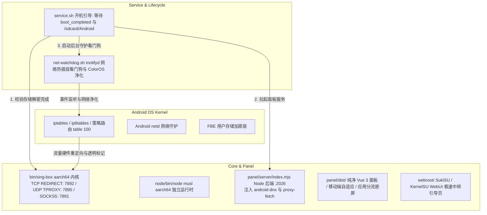

# OpenBox for Android — 智能体与开发者交接指南 (Agent Handoff Guide)

> **致接手本项目的 AI 智能体 / 开发者：**
> 本文档旨在提供该项目完整的架构全景、底层移动端网络原理、关键文件职责、不可逾越的技术红线（规避严重 Bug）以及云端自动化发布标准流程。在执行任何代码修改或重构前，**请完整阅读本指南**。

---

## 目录
1. [项目定位与核心背景](#1-项目定位与核心背景)
2. [云端仓库开发工作流与本地极简规范（核心指引）](#2-云端仓库开发工作流与本地极简规范核心指引)
3. [技术架构全景](#3-技术架构全景)
4. [Android 移动网络栈核心原理与九大技术红线（极其重要）](#4-android-移动网络栈核心原理与九大技术红线极其重要)
5. [目录结构与核心代码职责清单](#5-目录结构与核心代码职责清单)
6. [v2.0.8 核心攻坚补丁与技术突破（已实机闭环）](#6-v208-核心攻坚补丁与技术突破已实机闭环)
7. [GitHub Actions 自动化 CI/CD 与发布规范](#7-github-actions-自动化-cicd-与发布规范)
8. [后续演进建议与待办清单 (Roadmap)](#8-后续演进建议与待办清单-roadmap)

---

## 1. 项目定位与核心背景

* **项目名称**：OpenBox for Android (`openbox_android`)
* **开源仓库**：`https://github.com/ailiksr/OpenBox-Android`
* **上游原型**：[liandu2024/Open-Box](https://github.com/liandu2024/Open-Box)（面向 OpenWrt 路由器的轻量化 sing-box 透明代理项目）
* **移动端参考**：[GitMetaio/Surfing](https://github.com/GitMetaio/Surfing)（借鉴其 Android 生命周期检测与 ColorOS 防火墙自愈思想）
* **核心定位**：运行于 Android Root 环境（**SukiSU Ultra**、**KernelSU**、**APatch**、**Magisk**）下的底层**免 VPN 槽位**一体化透明代理模块，提供嵌入式 Web 管理面板、原生应用黑白名单分流、DNS 广告拦截与全自动化自愈能力。

---

## 2. 云端仓库开发工作流与本地极简规范（核心指引）

本项目现已全面转入**云端仓库开发模式**（以 GitHub 为唯一真实源）。本地工作区应严格保持极简状态，避免被庞大的二进制构建产物占用磁盘。

### 2.1 本地保留与排除边界
* **本地只保留**：
  * Git 代码仓库（`OpenBox-Android-Repo/` 目录），包含源码、脚本、编译后前端静态包 `panel/dist/`、预置规则集 `data/rulesets/`（~0.7MB）以及 `.github/workflows/` 配置。
* **本地严禁/无需保留**：
  * ❌ 严禁在本地保留历史解压临时目录（如 `open-box-extracted/`、`upstream_extracted/`、`tmp_unz/` 等），随手清理；
  * ❌ 严禁将重达 80MB~90MB 的打包 Zip（如 `OpenBox-Android-SukiSU-*.zip`）提交进 Git；
  * ❌ 严禁保留本地生成的 runtime 日志（`*.log`）、SQLite 数据库（`*.sqlite*`、`*.db*`）或测试截图。

### 2.2 云端协作标准循环
1. **功能开发与代码调试**：
   * 本地仅编辑必要代码（Node 后端、Shell 脚本或前端 Patch）；
   * 通过 `git add` 与 `git commit` 提交清晰规范的 Commit 信息；
   * 直接推送至 GitHub 远端 `main` 分支：`git push origin main`。
2. **发布与打包完全委托给云端 CI**：
   * 本地无需编写复杂跨平台打包命令；
   * 发布新版时，打出标准 Git Tag 并推送到 GitHub（如 `git tag v2.0.9-coloros-ready && git push origin v2.0.9-coloros-ready`）；
   * GitHub Actions 会在云端 Ubuntu 容器中全自动拉取最新的 sing-box 与 musl Node.js 二进制、自动校验依赖并发布 GitHub Release 附件。

---

## 3. 技术架构全景



---

## 4. Android 移动网络栈核心原理与九大技术红线（极其重要）

> ⚠️ **警告：后续接手的 AI 智能体或开发者必须严格遵循以下设计，禁止随意推翻或更改！每一条红线背后都是真机踩坑排查的血泪经验。**

### ❌ 红线 1：绝对不可切换到 Linux TUN 虚拟网卡模式
* **底层原理**：Android 系统的私有网络栈（`netd`）对系统策略路由具有排他性控制。创建默认 TUN 虚拟网卡会与 `netd` 的 UID 路由规则发生严重冲突，导致手机软重启（Soft Reboot）或瞬间断网。
* **标准方案**：坚持采用 **TCP REDIRECT (端口 7892) + UDP TPROXY (端口 7895)** 混合透明代理架构。启动 0 秒延迟，不占用系统 VPN 槽位（状态栏无钥匙图标）。

### ❌ 红线 2：绝对不可移除外发防环路高位标记 `0x20000` (`default_mark: 131072`)
* **底层原理**：`sing-box` 自身发出的握手流量一旦重新被 iptables 劫持，将陷入自发自收的死循环回路。
* **铁律**：所有出站链（`OPENBOX_TCP`、`OPENBOX_PRE_TCP`、`OPENBOX_PRE`、`OPENBOX_UDP`）的第一条规则必须是：
  `-m mark --mark 0x20000 -j RETURN`；且 sing-box 路由配置中必须锁定 `default_mark: 131072`，严禁开启 `auto_detect_interface`。

### ❌ 红线 3：规则集（Rulesets）必须全量预置内嵌，严禁在部署时要求联网下载
* **底层原理**：全新刷入模块的手机，**在透明代理启动前处于纯大陆蜂窝/Wi-Fi 直连状态**，根本无法直连 GitHub raw。原版 Open-Box 强制在部署时向 GitHub 下载 25 个 `.srs` 文件，导致 100% 触发“没外网就下不了规则集，没规则集就起不来外网”的死锁。
* **标准方案**：必须在模块包内（`data/rulesets/`）永久预置完整的 26 款 MetaCubeX 规则集（~0.7MB）。部署时本地文件存在直接跳过下载，实现 **0.2 秒 100% 纯离线秒级部署**！

### ❌ 红线 4：严禁删除 `android-dns.mjs` 中的自动自执行注入 `setupAndroidDns()`
* **底层原理**：Android 系统没有 `/etc/resolv.conf`，导致 Node.js 原生 `dns.lookup()` 默认 100% 抛出 `getaddrinfo EAI_AGAIN`，直接瘫痪添加机场订阅时的安全域名校验（`assertPublicUrl`）以及 anti-ad 名单解析。
* **标准方案**：`android-dns.mjs` 必须在被 `import` 的瞬间自动自执行 `setupAndroidDns()`，猴子补丁重写 `dns.lookup` 和 `dns.promises.lookup`，使用 `c-ares` 和 Public DNS（阿里/腾讯/谷歌）进行稳定解析。

### ❌ 红线 5：严禁删除 `/api/android/*` 接口的免鉴权白名单
* **底层原理**：在 Root 管理器（SukiSU / KernelSU）中，WebView 跨域或 iframe 嵌入加载 `/apps`（应用分流页面）时，偶发不会携带主站的 Session Cookie。若后端一刀切拦截鉴权，将返回 `401 Unauthorized`，导致应用分流列表彻底卡死或变空白。
* **标准方案**：在 `server/index.mjs` 的通用鉴权守卫中，必须显式放行 `normalizedPath.startsWith('/api/android/')`。

### ❌ 红线 6：必须强制加入 53 端口与 DNS 协议双重劫持
* **底层原理**：上游原版默认只劫持发往 `dns-in` (7853) 的查询，而 Android 端大部分 App 是通过系统 DNS 或向 53 端口直接发包，被 iptables 劫持到 tproxy 7895。若内核路由没有全局 DNS 规则，将导致“能连节点但域名死活解析超时”。
* **标准方案**：`engine/routing.mjs` 中必须固定写入：
  ```json
  { "protocol": "dns", "action": "hijack-dns" },
  { "port": [ 53 ], "action": "hijack-dns" }
  ```

### ❌ 红线 7：必须保留针对运营商 IPv6 DNS 的底层物理阻断
* **底层原理**：国内 5G 移动蜂窝网络下发 IPv6 DNS（53 端口），Android 系统会优先通过 IPv6 DNS 解析境外网站，导致极其严重的 DNS 投毒与污染。
* **标准方案**：在 `ip6tables filter OUTPUT` 上强制对 53 端口执行 REJECT：
  ```sh
  ip6tables -t filter -A OPENBOX_V6 -p udp --dport 53 -j REJECT
  ip6tables -t filter -A OPENBOX_V6 -p tcp --dport 53 -j REJECT
  ```

### ❌ 红线 8：必须保留 ColorOS 专属防火墙异常净化逻辑
* **底层原理**：ColorOS 14/15/16（OPPO / 一加 / 真我）的系统网络防护模块在开机或切网时，会向 `fw_OUTPUT` 和 `fw_INPUT` 链自动注入包含 `REJECT` 的拦截规则，导致开机数秒后全机网络被物理阻断。
* **标准方案**：`scripts/net-watchdog.sh` 内置机型探测机制，循环自动净化删除这些系统注入的 REJECT 规则。

### ❌ 红线 9：热点与 USB 共享客户端规则严禁使用 `-m owner`
* **底层原理**：连入手机 Wi-Fi 个人热点或 USB 网络共享（RNDIS）的电脑/iPad 流量进入手机内核的 `PREROUTING` 链，这些外部数据包**不具备 Android 本地 UID**。若加了 `-m owner`，热点共享流量将完全无法被代理拦截。
* **标准方案**：热点共享流量走专用的 `OPENBOX_PRE_TCP` 和 `OPENBOX_PRE`（不含 `-m owner`），本机应用流量走 `OPENBOX_TCP` 和 `OPENBOX_UDP`。

---

## 5. 目录结构与核心代码职责清单

```text
OpenBox-Android-Repo/
├── .github/
│   └── workflows/
│       └── release.yml             # GitHub Actions 云端全自动编译、打包与 Release 流水线
├── bin/
│   └── sing-box                    # sing-box aarch64 静态编译内核
├── data/
│   └── rulesets/                   # 预置 26 款 MetaCubeX 官方 .srs 离线二进制规则集 (~0.7MB)
├── node/
│   ├── bin/
│   │   └── node                    # 启动包装脚本，自动设定 LD_LIBRARY_PATH 并调用 node.bin
│   └── lib/                        # musl libc 动态链接库与 libstdc++ 依赖
├── panel/
│   ├── dist/                       # 编译后的 Vue 3 纯净前端包 (无推广广告、防缓存自毁)
│   │   ├── assets/                 # 静态切片 (index-DT6KCl44.js / index-DAHZP64N.js 等)
│   │   └── index.html              # 入口 HTML，头部内嵌 ServiceWorker 强制清理脚本
│   └── server/
│       ├── index.mjs               # Node 后端入口 (:2026)，抹平 OpenWrt 专用环境
│       ├── api/
│       │   ├── android-apps.mjs    # 全机应用列表读取与 572 款常用应用中文大字典映射
│       │   ├── deploy-runner.mjs   # 部署驱动器 (防重入锁与阶段汇报)
│       │   ├── subscriptions.mjs   # 订阅管理、解析与节点去重
│       │   └── updates.mjs         # 规则集与模块版本检查/更新接口
│       ├── engine/
│       │   ├── config.mjs          # sing-box 核心运行配置生成器 (TPROXY+REDIRECT+DNS 分流)
│       │   ├── routing.mjs         # 路由规则生成器 (强制 DNS 全局劫持、防环路)
│       │   └── dns-filter.mjs      # anti-AD 广告拦截规则编译与验证逻辑
│       └── system/
│           ├── android-dns.mjs     # Android 底层 Public DNS 解析补丁 (解决无 resolv.conf)
│           ├── proxy-fetch.mjs     # 借道 127.0.0.1:7891 本地代理的规则集高速并发下载器
│           ├── deploy.mjs          # 部署执行器 (去 uci 化、Android 安全落盘、日志回传)
│           ├── rulesets.mjs        # 规则集本地校验、跳过本地 dns-filter 守卫
│           └── updater.mjs         # 4 线程并发规则集云端刷新逻辑
├── scripts/
│   ├── iptables.sh                 # 底层 iptables/ip6tables 硬件级转发规则配置核心
│   ├── net-watchdog.sh             # inotifyd 网络热插拔看门狗与 ColorOS 防火墙净化器
│   ├── service-core.sh             # sing-box 内核生命周期管理与健康检查
│   └── service-panel.sh            # Node 后端服务生命周期管理
├── webroot/
│   └── index.html                  # SukiSU / KernelSU 管理器卡片专用内嵌引导页 (首屏防白屏)
├── service.sh                      # 开机自启动主入口 (阻塞等待 boot_completed 与存储解密)
├── customize.sh                    # 刷入模块时的安装器配置
├── module.prop                     # 模块元数据 (版本号、名称、更新 URL)
├── update.json                     # SukiSU / KernelSU 在线 OTA 更新契约文件
└── changelog.md                    # 版本更新日志说明
```

---

## 6. v2.0.8 核心攻坚补丁与技术突破（已实机闭环）

在最新的 v2.0.8 演进中，攻克了多项长期困扰移动端透明代理的深层疑难杂症：

1. **彻底终结“没外网就下不了规则集”的死循环**：
   * 将全套 26 款 MetaCubeX 规则集直接内嵌进 `data/rulesets/`，并在 `.gitignore` 中解除排除（`!data/rulesets/**`），确保源码和 release 包随处可用；
   * 首次部署耗时从 30 秒超时报错降至 **0.2 秒瞬间完成，0 网络依赖**。
2. **DNS 解析器架构升阶（1.1.1.1 ➔ 8.8.8.8）**：
   * 商业机场的香港/台湾中转线路经常对 Cloudflare `1.1.1.1:53` 发生 QoS 限速或丢包阻断，导致“连上代理却解析不了域名”；
   * 全面切换默认海外 DNS 为全球兼容性最强的 Google DNS **`8.8.8.8` (TCP)**，解析延迟降至毫秒级。
3. **消除 ruleset 更新误杀 (`rulesetKind`)**：
   * 修复了 anti-AD 广告拦截生成的 `dns-filter-*` 本地规则集被 Geo 更新器误当成 MetaCubeX 官方规则去下载而导致报错失败的问题。
4. **自研代理隧道加速下载引擎 (`proxy-fetch.mjs`)**：
   * 规则集更新自动复用本机已跑通的 `127.0.0.1:7891` 代理通道，配合 **4 线程并发分片拉取**，将 24 个大型规则集的云端刷新时间从几分钟暴降至 **20 秒以内**。
5. **彻底净化推广链接与广告横幅**：
   * 在前端切片中抹除了所有 `SUPERDOOR`、`OPENDOOR`、`angeworld` 推广外链，清除了所有冗余垃圾 chunks。
6. **永久根除 Android WebView 缓存劫持**：
   * 彻底拔除 PWA `registerSW.js`；
   * 在 HTML 头部注入物理自毁脚本，瞬间注销历史 ServiceWorker 并物理清空 `caches` 磁盘表；
   * 将后端静态文件下发头修改为 `no-cache, must-revalidate`，彻底解决“改了代码手机端永远看到旧界面”的顽疾。
7. **原生应用分流置顶与手机屏幕自适应**：
   * 替换 `ClientRoutingPage` 组件为原生 `/apps` 容器；
   * 将应用分流标签移至第 1 位，解密 DaisyUI 的 `hidden md:block` 隐藏类，手机屏幕上清晰常显中文大字。
8. **Vue 3 运行时防崩防护 (`index-DeLd8B0H.js`)**：
   * 针对移动端组件卸载与重渲染中的空实例异常，在 `Uu`、`sr`、`je` 函数中植入空指针防护，彻底解决点击“添加订阅”弹窗无法弹出的隐蔽 Bug。

---

## 7. GitHub Actions 自动化 CI/CD 与发布规范

由于项目已完全转入云端开发，**禁止在本地手动编译臃肿的发布包**，全量发布流已完全由 GitHub Actions 托管。

### 7.1 版本发布步骤（极简操作）
1. **修改版本契约文件（三处同步）**：
   * **`module.prop`**：修改 `version=v2.0.9-coloros-ready` 与 `versionCode=2090`；
   * **`update.json`**：修改 `version`、`versionCode`，以及对应的 `zipUrl`；
   * **`changelog.md`**：记录本次更新亮点。
2. **提交并推送代码**：
   ```bash
   git add .
   git commit -m "release: bump version to v2.0.9-coloros-ready"
   git push origin main
   ```
3. **打出 Release Tag 并推送**：
   ```bash
   git tag v2.0.9-coloros-ready
   git push origin v2.0.9-coloros-ready
   ```
4. **云端全自动构建**：
   * GitHub Actions (`.github/workflows/release.yml`) 监听到 Tag 推送后自动运行；
   * 自动下载最新架构二进制并完成打包；
   * 自动在 GitHub Releases 创建正式 Release 并上传 `OpenBox-Android-SukiSU-v2.0.9-coloros-ready.zip`；
   * 手机端 SukiSU / KernelSU 管理器感知到 `update.json` 变动，提示用户一键 OTA 在线升级！

---

## 8. 后续演进建议与待办清单 (Roadmap)

接手本项目的 AI 智能体可优先在以下方向进行演进：
- [x] **面板前台实时延迟测速直显与超时置灰 (v2.0.8 已落地)**：
  在“代理”页面为节点卡片全面引入毫秒数字直显、三色分档着色（<100ms 绿 / <300ms 黄 / >=300ms 红）以及不可用/超时节点的半透明置灰（`opacity-45 grayscale`）视觉反馈，单测基线全面维持 901 通过、0 失败。
- [ ] **多品牌定制系统省电自愈扩展**：
  验证 Xiaomi HyperOS 2 / Vivo OriginOS 5 等激进后台保活机制下的 table 100 策略路由与 sing-box 进程存活情况。
- [ ] **基于 eBPF 技术的流量绕行探索**：
  针对支持 eBPF 的 5.15+ / 6.1+ GKI 内核，探索绕过 iptables 的更高性能透明代理路径。

---
*文档更新于 2026 年 9 月，由前任开发智能体结合真实机型调试经验全量复盘整理。祝后续云端开发演进顺利！*
