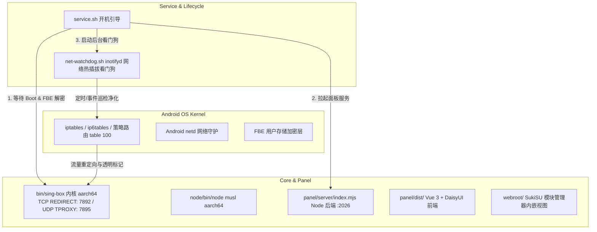

# OpenBox for Android — 智能体与开发者交接指南 (Agent Handoff Guide)

> **致接手本项目的 AI 智能体 / 开发者：**
> 本文档旨在提供该项目完整的架构全景、底层移动端网络原理、关键文件职责、不可逾越的技术红线（规避严重 Bug）以及发布与打包标准流程。请在执行任何代码修改或重构前，**完整阅读本指南**。

---

## 目录
1. [项目定位与核心背景](#1-项目定位与核心背景)
2. [技术架构全景](#2-技术架构全景)
3. [Android 移动网络栈核心原理与技术红线（极其重要）](#3-android-移动网络栈核心原理与技术红线极其重要)
4. [目录结构与核心代码职责清单](#4-目录结构与核心代码职责清单)
5. [v2.0.8 已落地的关键补丁与特性](#5-v208-已落地的关键补丁与特性)
6. [打包、版本控制与云端发布规范](#6-打包版本控制与云端发布规范)
7. [后续演进建议与待办清单 (Roadmap)](#7-后续演进建议与待办清单-roadmap)

---

## 1. 项目定位与核心背景

* **项目名称**：OpenBox for Android (`openbox_android`)
* **开源仓库**：`https://github.com/ailiksr/OpenBox-Android`
* **上游原型**：[liandu2024/Open-Box](https://github.com/liandu2024/Open-Box)（面向 OpenWrt 路由器的透明代理项目）
* **移动端参考**：[GitMetaio/Surfing](https://github.com/GitMetaio/Surfing)（借鉴其网络生命周期探测与 ColorOS 自愈理念）
* **定位**：运行于 Android Root 环境（**SukiSU Ultra**、**KernelSU**、**APatch**、**Magisk**）下的底层**免 VPN 槽位**一体化透明代理模块，提供嵌入式 Web 管理面板与原生应用分流能力。

---

## 2. 技术架构全景

系统在 Android 平台采用完全松耦合的分层架构：



1. **核心代理层 (`sing-box`)**：静态编译的 `aarch64` sing-box，提供入站、出站路由、DNS 分流与规则集匹配；
2. **面板服务层 (`Node.js + Vue 3`)**：通过模块内置的独立 musl `node` 二进制运行 `panel/server/index.mjs`（监听 `0.0.0.0:2026`），抹平了 OpenWrt 专有环境（`uci`、`procd`、`dnsmasq`），转换为 Android 本地文件存储（`data/`、`etc/`）；
3. **管理呈现层 (`webroot/`)**：供 SukiSU Ultra 或 KernelSU 管理器内部直接以内嵌卡片形式唤起全屏面板，亦支持局域网直接浏览器访问。

---

## 3. Android 移动网络栈核心原理与技术红线（极其重要）

> ⚠️ **警告：接手智能体必须严格遵循以下设计，禁止随意推翻或更改！**

### ❌ 红线 1：绝对不要切换到 Linux TUN 虚拟网卡模式
* **原因**：Android 系统的私有网络栈（`netd`）对系统路由表具有强制干预机制。在移动端创建默认 TUN 路由极易引发死锁、路由黑洞，甚至导致开机直接软重启（Soft Reboot）。
* **标准方案**：本项目坚定采用 **TCP REDIRECT (端口 7892) + UDP TPROXY (端口 7895)** 混合透明代理架构。启动耗时 0.00 秒，无需创建 TUN，不占用系统 VPN 槽位（状态栏无钥匙图标）。

### ❌ 红线 2：绝对不可移除或随意改动外发防环路标记 `0x20000`
* **原因**：代理内核自身（`sing-box`）向外发出的握手流量如果重新被 iptables 劫持，将产生死循环（环路风暴），手机将在 1 秒内瞬间耗尽网络连接并断网。
* **规则**：所有出站链（`OPENBOX_TCP`、`OPENBOX_PRE_TCP`、`OPENBOX_PRE`、`OPENBOX_UDP`）的第一条规则必须是：
  `-m mark --mark 0x20000 -j RETURN`。

### ❌ 红线 3：必须保留针对运营商 IPv6 DNS 的底层丢弃规则
* **原因**：国内运营商蜂窝网络（5G/4G）下发 IPv6 DNS（53 端口），Android 会优先使用 IPv6 DNS 解析境外网站，导致严重 DNS 投毒与污染。
* **规则**：在 `ip6tables filter OUTPUT` 链上必须强制对 53 端口执行 `REJECT`：
  ```sh
  ip6tables -t filter -A OPENBOX_V6 -p udp --dport 53 -j REJECT
  ip6tables -t filter -A OPENBOX_V6 -p tcp --dport 53 -j REJECT
  ```

### ❌ 红线 4：必须保留 ColorOS 专属防火墙异常净化逻辑
* **原因**：ColorOS 14/15/16（OPPO / 一加 / 真我）的系统网络防护服务在开机或切网时，会向 `fw_OUTPUT` 和 `fw_INPUT` 链注入包含 `REJECT` 的拦截规则，导致开机数秒后整个网络被物理阻断。
* **实现**：`scripts/net-watchdog.sh` 内置了机型嗅探机制，定期扫描并自动删除这些多余的 REJECT 规则。

### ❌ 红线 5：热点与 USB 共享客户端规则不可使用 `-m owner` 匹配
* **原因**：连入手机 Wi-Fi 个人热点或 USB 共享（RNDIS）的电脑/iPad 流量进入手机内核的 `PREROUTING` 链，这些外部数据包**没有 Android 本地 UID**。若在该链上增加 `-m owner` 校验，外部客户端的流量将完全无法被代理拦截。
* **实现**：外部流量走专用的 `OPENBOX_PRE_TCP` 和 `OPENBOX_PRE`，本机应用流量走 `OPENBOX_TCP` 和 `OPENBOX_UDP`。

---

## 4. 目录结构与核心代码职责清单

```text
OpenBox-Android-Repo/
├── bin/
│   └── sing-box                    # aarch64 静态编译内核二进制
├── node/
│   └── bin/node                    # aarch64 musl 独立 Node.js 运行时
├── panel/
│   ├── dist/                       # 前端编译包 (Vue 3 + DaisyUI)，无商业引流广告
│   └── server/
│       ├── index.mjs               # Node 后端 API 入口 (端口 2026)
│       └── system/                 # 系统级接口适配 (去 uci 化)
├── scripts/
│   ├── iptables.sh                 # 底层 iptables/ip6tables 规则装载与卸载核心
│   ├── net-watchdog.sh             # inotifyd + 10秒循环网络看门狗与 ColorOS 净化器
│   ├── service-core.sh             # sing-box 内核启动、停止、守护脚本
│   ├── service-panel.sh            # Node 后端服务启动、停止、守护脚本
│   ├── add-bypass.sh               # 终端快捷应用黑名单管理器
│   └── audit-hma.sh                # Hide My Applist / 权限审计脚本
├── webroot/
│   └── index.html                  # SukiSU / KernelSU WebUI 插件规范入口
├── system/                         # 模块注入 Android 系统的空挂载文件
├── service.sh                      # 开机异步启动引导 (含 FBE 解密探测)
├── customize.sh                    # Magisk / KernelSU 安装刷入时的安装器脚本
├── action.sh                       # 管理器卡片动作脚本
├── module.prop                     # 模块元数据 (版本、作者、更新URL)
├── update.json                     # SukiSU 在线更新契约文件
└── changelog.md                    # 版本更新日志
```

---

## 5. v2.0.8 已落地的关键补丁与特性

在修改面板或规则时，接手智能体需注意以下已验证的技术补丁：
1. **独立 DNS 设置**：与上游 v0.1.159 对齐，支持在面板内独立配置规则集 DNS 路由重写；
2. **anti-AD 域名拦截**：预置 `https://anti-ad.net/easylist.txt` 规则集，并加入 DNS 过滤拦截；
3. **单卡片一键休眠**：订阅卡片支持单独开关，关闭的订阅自动剔除出内核配置，不发起后台网络检查；
4. **弱网断流保底**：订阅更新时若遇网络断开，坚决报错并保留本地现有节点，不进行空覆盖；
5. **国内 204 测速修正**：直连出站测速地址统一采用国内高可用 204，杜绝直连测 Google 报超时的假死；
6. **前端纯净化与无缓存**：移除了原路由版的所有广告推广横幅，并在后端禁用了过激的静态不可变缓存。

---

## 6. 打包、版本控制与云端发布规范

### 1. 本地打包规范 (Zip Package)
构建刷机包时，**Zip 根目录必须直接是模块根文件**，严禁套一层外层目录：

```bash
# 正确的打包命令（在 OpenBox-Android-Repo 根目录下执行）：
zip -r9 ../OpenBox-Android-SukiSU-v2.0.8.zip . -x ".git/*" ".github/*" "*.DS_Store" "AGENT_HANDOFF.md"
```

### 2. 版本号三处强制同步
每次发布新版本（例如 `v2.0.9`），必须且只能同步更新以下 3 个文件：
1. **`module.prop`**：
   * `version=v2.0.9-coloros-ready`
   * `versionCode=2090`
2. **`update.json`**：
   * `version`: 与上方一致
   * `versionCode`: 与上方一致
   * `zipUrl`: 指向 GitHub Releases 的真实下载链接
3. **`changelog.md`**：
   * 补充该版本的更新日志摘要。

### 3. 云端发布流水线
* 本地工作区保持轻量，打出的测试 zip 验证完成后不要提交进 git；
* 打 Git Tag 并推送到 GitHub：
  ```bash
  git tag v2.0.9-coloros-ready
  git push origin v2.0.9-coloros-ready
  ```
* 在 GitHub Releases 页面创建 Release，上传打包出的 `OpenBox-Android-SukiSU-v2.0.9.zip`。
* 手机端 SukiSU 会自动比对 `update.json` 中的 `versionCode`，提示用户一键在线更新。

---

## 7. 后续演进建议与待办清单 (Roadmap)

接手智能体可优先在以下方向进行迭代：
- [ ] **GitHub Actions 自动化 CI 构建**：
  在 `.github/workflows/` 中编写自动打包流，当推送 `v*` tag 时，自动运行打包命令并将 zip 文件作为附件发布到 GitHub Releases。
- [ ] **规则集下载加速与代理自拉取**：
  对 `anti-ad.srs`、`geoip.srs`、`geosite.srs` 等体积较大的规则集更新，在直连受阻时尝试通过 sing-box 已建立的本地代理通道加速下载。
- [ ] **多品牌系统自愈扩展**：
  当前针对 ColorOS 的自愈机制极其成熟；后续可进一步验证 Xiaomi HyperOS、Vivo OriginOS 等定制系统在激进后台省电策略下的策略路由存活表现。

---
*文档生成于 2026 年 9 月，由前任开发智能体整理留存。祝后续开发顺利！*
